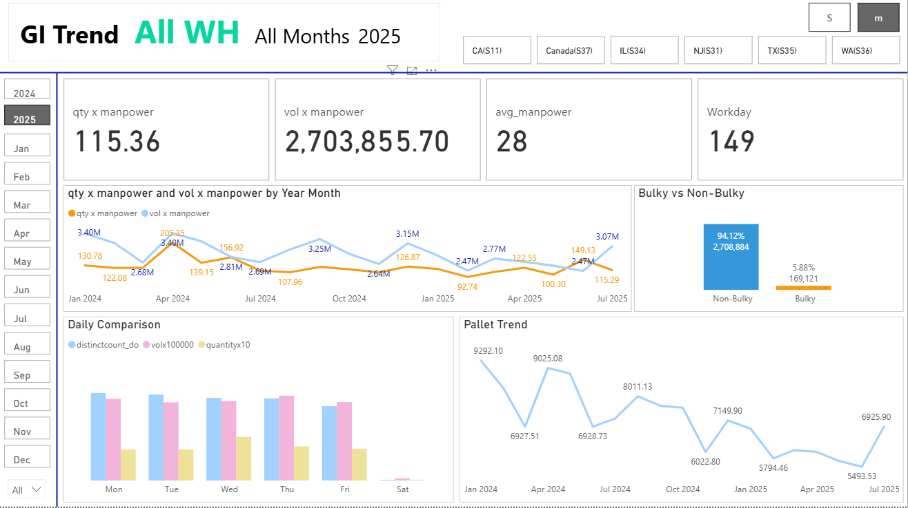
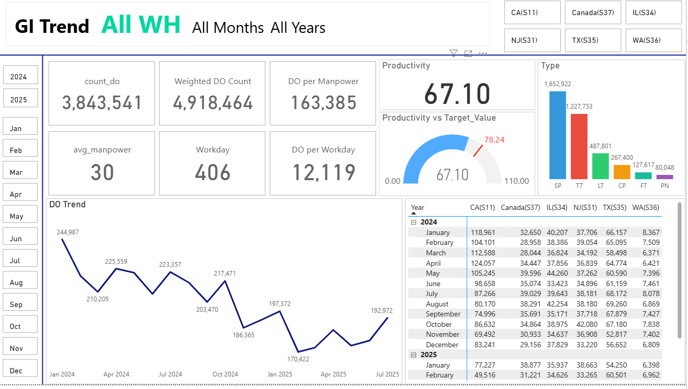
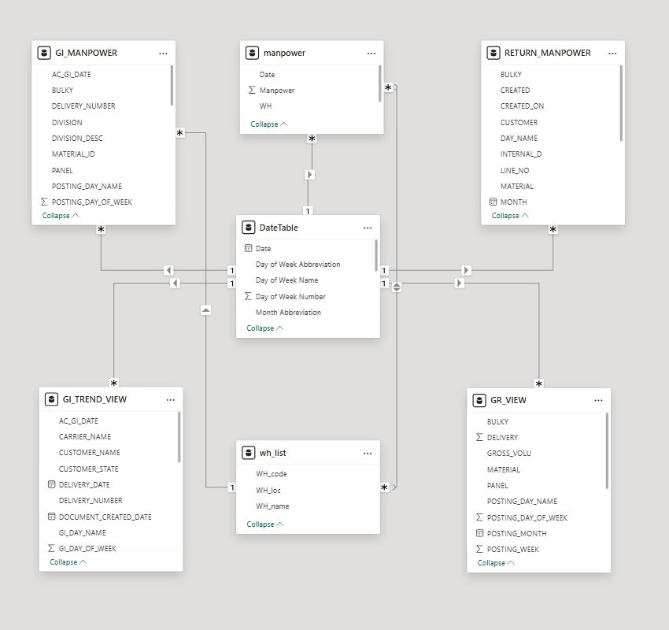
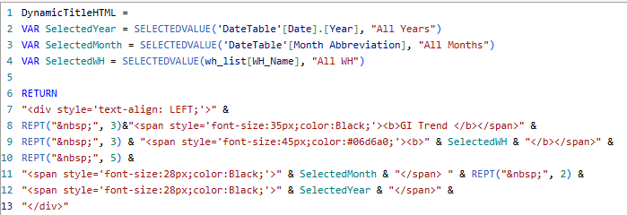
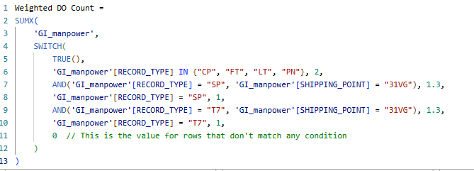

# GI Trend Dashboard - Technical Documentation

## Overview
This Power BI dashboard provides comprehensive analytics for warehouse operations, tracking delivery orders (DO), manpower utilization, and productivity metrics across multiple locations and time periods.

## Dashboard Screenshots

### Main Dashboard View (2025 Data)

*Key metrics display including quantity x manpower, volume x manpower, average manpower, and workday statistics with trend analysis*

### Historical Analysis View

*Historical data comparison showing productivity trends, DO counts, and year-over-year performance metrics*

## Data Architecture

### Data Sources
- **Primary Source**: Snowflake Data Warehouse
- **ETL Process**: Excel and Python for data extraction and transformation
- **Visualization**: Power BI Desktop

### Data Flow Process
1. **Extraction**: Raw data extracted from Snowflake using SQL queries
2. **Transformation**: Data cleansing and preparation using:
   - Excel for initial data manipulation
   - Python scripts for advanced transformations
3. **Loading**: Processed data imported into Power BI for visualization

## Data Model Structure

### Table Relationships


The data model consists of six interconnected tables:

#### Core Tables:
1. **GI_MANPOWER**
   - Primary manpower data
   - Contains: AC_GL_DATE, BULKY, DELIVERY_NUMBER, DIVISION, MATERIAL_ID, PANEL, POSTING_DAY_NAME, POSTING_DAY_OF_WEEK

2. **manpower**
   - Supplementary manpower information
   - Contains: Date, Manpower, WH fields

3. **RETURN_MANPOWER**
   - Return processing manpower data
   - Contains: BULKY, CREATED, CUSTOMER, DAY_NAME, INTERNAL_ID, LINE_NO, MATERIAL, MONTH

4. **DateTable**
   - Date dimension table
   - Contains: Date, Day of Week details, Month Abbreviation

5. **GI_TREND_VIEW**
   - Aggregated trend data
   - Contains: Customer details, delivery information, document dates

6. **wh_list**
   - Warehouse reference data
   - Contains: WH_code, WH_location, WH_name

#### Relationship Structure:
- **One-to-Many** relationships connect the DateTable to transactional tables
- **Many-to-One** relationships link warehouse and location data
- Star schema design optimizes query performance

## DAX Measures and Calculations

### Dynamic Title Generation

```dax
DynamicTitleHTML = 
VAR SelectedYear = SELECTEDVALUE('DateTable'[Date].[Year], "All Years")
VAR SelectedMonth = SELECTEDVALUE('DateTable'[Month Abbreviation], "All Months")
VAR SelectedWH = SELECTEDVALUE(wh_list[WH_Name], "All WH")
RETURN
"<div style='text-align: LEFT;'>" &
REPT("&nbsp;", 3)&"<span style='font-size:35px;color:Black;'><b>GI Trend </b></span>" &
REPT("&nbsp;", 3) & "<span style='font-size:45px;color:#06dad6;'><b>" & SelectedWH & "</b></span>" &
REPT("&nbsp;", 5) &
"<span style='font-size:28px;color:Black;'>" & SelectedMonth & " " & REPT("&nbsp;", 2) &
"<span style='font-size:28px;color:Black;'>" & SelectedYear &
"</div>"
```

### Weighted DO Count Calculation

```dax
Weighted DO Count = 
SUMX(
    'GI_manpower',
    SWITCH(
        TRUE(),
        'GI_manpower'[RECORD_TYPE] IN ("CP", "FT", "LT", "PN"), 2,
        AND('GI_manpower'[RECORD_TYPE] = "SP", 'GI_manpower'[SHIPPING_POINT] = "31VG"), 1.3,
        'GI_manpower'[RECORD_TYPE] = "SP", 1,
        AND('GI_manpower'[RECORD_TYPE] = "T7", 'GI_manpower'[SHIPPING_POINT] = "31VG"), 1.3,
        'GI_manpower'[RECORD_TYPE] = "T7", 1,
        0 // Default value for rows that don't match any condition
    )
)
```

## Key Features

### Filtering Capabilities
- **Geographic Filters**: CA(S11), Canada(S37), IL(S34), NJ(S31), TX(S35), WA(S36)
- **Time Period Filters**: Month and year selection with dynamic updates
- **Warehouse Selection**: Multi-warehouse comparison capabilities

### Visualizations Included
1. **KPI Cards**: Key metrics display (qty x manpower, vol x manpower, avg_manpower, workday)
2. **Trend Lines**: Time series analysis for quantity and volume trends
3. **Comparison Charts**: Bulky vs Non-Bulky analysis
4. **Geographic Breakdown**: Performance by warehouse location
5. **Daily Patterns**: Weekday performance comparison
6. **Productivity Gauges**: Target vs actual performance tracking

### Interactive Elements
- **Cross-filtering**: Selections in one visual filter related visuals
- **Drill-down capabilities**: Navigate from year to month to day level
- **Dynamic titles**: Context-aware headers that update based on selections
- **Responsive design**: Adapts to different screen sizes and orientations


